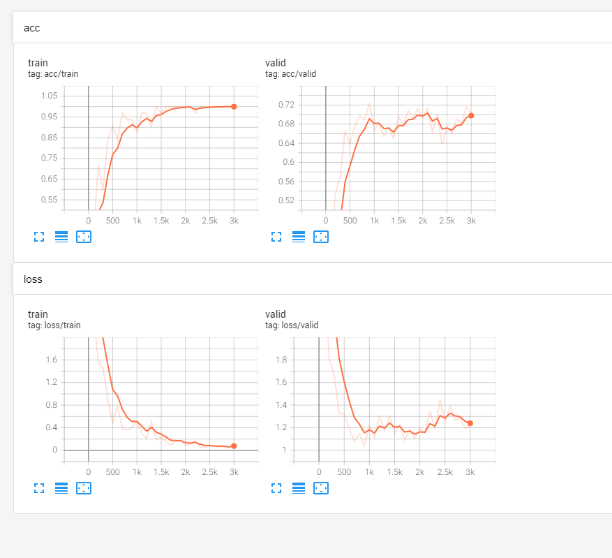

# Py-dnn
Deep Neural Networks Models powered by Pytorch

**version v0.0.1**

### Plans

- [x] ImageClassifier (CNN model)
  
  > Transfer learning (using well-known models like **ResNet**)

- [ ] TextClassifier (CNN and RNN model)
   
  > Using word embeddings downloaded from Tencent or Sogou
  
- [ ] TextWriter 

   maybe writing poems?


### Modules

```shell
├── LICENSE
├── README.md
├── common.py
├── criterion
│   └── criterion.py
├── data_loader
│   ├── data_opt.py
│   └── image_loader.py
├── evaluate
│   └── image_classify_eval.py
├── model
│   ├── image_classify_model.py
│   └── models_opt.py
├── optimizer
│   └── optimizer.py
├── options
│   ├── base_opt.py
│   ├── image_classify_opt.py
│   └── options_opt.py
├── plot
│   └── plot_writer.py
├── resources
│   ├── data
│   ├── log
│   ├── result
│   └── saved_model
└── run.py
```

### Usages

**for example**
```shell
$ python image_classify_run.py [--data DATA] [--log LOG] [--model_save MODEL_SAVE]
                    [--model {VGG,ResNet,DenseNet,ResNext}]
                    [--work {train,test}] [--batch_size BATCH_SIZE]
                    [--epoch_num EPOCH_NUM] [--optimizer {Adam}]
                    [--learning_rate LEARNING_RATE] [--beta1 BETA1]
                    [--beta2 BETA2] [--lr_scheduler {StepLR}] [--gamma GAMMA]
                    [--loss {NLLLoss}] [--thread_num THREAD_NUM]
                    [--gpu_ids GPU_IDS] [--plot] [--help]
```
**for example**

| Resource Arguments | Dest       | Help                                                                                                                                                                           |
|--------------------|------------|--------------------------------------------------------------------------------------------------------------------------------------------------------------------------------|
| --data             | DATA       | for train, the path should have sub-folders train and valid;for test, should have sub-folders test. [reference docs](https://pytorch.org/vision/stable/datasets.html#imagefolder) |
| --log              | LOG        | path to the log folder to record information.                                                                                                                                  |
| --model_save       | MODEL_SAVE | models are saved here.

### Logs 

**for example**

```shell
$ cd resources/log
$ ls
04-21_14.57
$ tensorboard --log_dir ./04-21_14.57
TensorFlow installation not found - running with reduced feature set.
Serving TensorBoard on localhost; to expose to the network, use a proxy or pass --bind_all
TensorBoard 2.4.1 at http://localhost:6006/ (Press CTRL+C to quit)
```
**like this**



**for example**

```shell
$ python image_classify_run.py --data resources/data/flowers
--------------------My Py-DNN by Pytorch--------------------
--------------------Options--------------------
-----Resource Arguments-----
data: resources/data/flowers	(default: None)	
log: resources/log
model_save: resources/saved_model/image_classify_model.pth	(default: resources/saved_model/model.pth)	
-----Model Arguments-----
model: ResNet
work: train
batch_size: 32
epoch_num: 15
-----Optimizer Arguments-----
optimizer: Adam
learning_rate: 0.001
beta1: 0.9
beta2: 0.999
lr_scheduler: None
gamma: 0.1
-----Other Arguments-----
loss: NLLLoss
thread_num: 4
gpu_ids: [0]	(default: 0)	
plot: False
help: False
--------------------End--------------------
Loading data...
Train sets: 6552
Valid sets: 818
Batch size: 32
Class nums: 102
100%|██████████| 205/205 [00:17<00:00, 11.48it/s]
100%|██████████| 26/26 [00:05<00:00,  4.71it/s]
Time usage: 0:00:23
using GPU 0.
Training data...
Epoch [1/15]
Iter:      0,  Train Loss:   4.7,  Train Acc:  0.00%,  Val Loss:   4.9,  Val Acc:  0.73%,  Time: 0:00:04
Iter:    100,  Train Loss:   2.7,  Train Acc: 46.88%,  Val Loss:   2.6,  Val Acc: 43.15%,  Time: 0:00:14
Iter:    200,  Train Loss:   2.0,  Train Acc: 53.12%,  Val Loss:   2.0,  Val Acc: 52.44%,  Time: 0:00:25
Epoch [2/15]
Iter:    300,  Train Loss:   1.4,  Train Acc: 65.62%,  Val Loss:   1.7,  Val Acc: 57.70%,  Time: 0:00:35
Iter:    400,  Train Loss:  0.97,  Train Acc: 84.38%,  Val Loss:   1.4,  Val Acc: 62.59%,  Time: 0:00:46
Epoch [3/15]
Iter:    500,  Train Loss:  0.75,  Train Acc: 78.12%,  Val Loss:   1.4,  Val Acc: 62.10%,  Time: 0:00:56
Iter:    600,  Train Loss:   1.0,  Train Acc: 75.00%,  Val Loss:   1.3,  Val Acc: 62.71%,  Time: 0:01:07
Epoch [4/15]
Iter:    700,  Train Loss:   0.3,  Train Acc: 96.88%,  Val Loss:   1.3,  Val Acc: 64.91%,  Time: 0:01:17
Iter:    800,  Train Loss:  0.33,  Train Acc: 96.88%,  Val Loss:   1.2,  Val Acc: 66.38%,  Time: 0:01:28
Epoch [5/15]
Iter:    900,  Train Loss:  0.36,  Train Acc: 93.75%,  Val Loss:   1.2,  Val Acc: 67.97%,  Time: 0:01:38
Iter:   1000,  Train Loss:  0.32,  Train Acc: 93.75%,  Val Loss:   1.1,  Val Acc: 67.36%,  Time: 0:01:48
Epoch [6/15]
Iter:   1100,  Train Loss:  0.38,  Train Acc: 90.62%,  Val Loss:   1.2,  Val Acc: 68.22%,  Time: 0:01:59
Iter:   1200,  Train Loss:  0.36,  Train Acc: 93.75%,  Val Loss:   1.2,  Val Acc: 67.24%,  Time: 0:02:09
Epoch [7/15]
Iter:   1300,  Train Loss:  0.14,  Train Acc: 100.00%,  Val Loss:   1.2,  Val Acc: 67.73%,  Time: 0:02:19
Iter:   1400,  Train Loss:  0.33,  Train Acc: 93.75%,  Val Loss:   1.2,  Val Acc: 67.48%,  Time: 0:02:29
Epoch [8/15]
Iter:   1500,  Train Loss:  0.24,  Train Acc: 96.88%,  Val Loss:   1.2,  Val Acc: 68.70%,  Time: 0:02:40
Iter:   1600,  Train Loss: 0.094,  Train Acc: 100.00%,  Val Loss:   1.1,  Val Acc: 69.68%,  Time: 0:02:50
Epoch [9/15]
Iter:   1700,  Train Loss:  0.18,  Train Acc: 96.88%,  Val Loss:   1.1,  Val Acc: 70.42%,  Time: 0:03:00
Iter:   1800,  Train Loss:  0.25,  Train Acc: 93.75%,  Val Loss:   1.1,  Val Acc: 70.05%,  Time: 0:03:11
Epoch [10/15]
Iter:   1900,  Train Loss:  0.19,  Train Acc: 96.88%,  Val Loss:   1.1,  Val Acc: 71.03%,  Time: 0:03:21
Iter:   2000,  Train Loss:  0.09,  Train Acc: 100.00%,  Val Loss:   1.1,  Val Acc: 70.42%,  Time: 0:03:29
Epoch [11/15]
Iter:   2100,  Train Loss:  0.11,  Train Acc: 100.00%,  Val Loss:   1.2,  Val Acc: 70.78%,  Time: 0:03:38
Iter:   2200,  Train Loss:  0.13,  Train Acc: 100.00%,  Val Loss:   1.1,  Val Acc: 71.27%,  Time: 0:03:46
Epoch [12/15]
Iter:   2300,  Train Loss: 0.055,  Train Acc: 100.00%,  Val Loss:   1.2,  Val Acc: 70.90%,  Time: 0:03:55
Iter:   2400,  Train Loss:  0.06,  Train Acc: 100.00%,  Val Loss:   1.2,  Val Acc: 71.03%,  Time: 0:04:04
Epoch [13/15]
Iter:   2500,  Train Loss: 0.088,  Train Acc: 100.00%,  Val Loss:   1.2,  Val Acc: 69.80%,  Time: 0:04:13
Iter:   2600,  Train Loss:  0.06,  Train Acc: 100.00%,  Val Loss:   1.2,  Val Acc: 71.76%,  Time: 0:04:22
Epoch [14/15]
Iter:   2700,  Train Loss: 0.096,  Train Acc: 100.00%,  Val Loss:   1.2,  Val Acc: 68.09%,  Time: 0:04:32
Iter:   2800,  Train Loss: 0.062,  Train Acc: 100.00%,  Val Loss:   1.2,  Val Acc: 69.93%,  Time: 0:04:41
Epoch [15/15]
Iter:   2900,  Train Loss:  0.06,  Train Acc: 100.00%,  Val Loss:   1.3,  Val Acc: 68.09%,  Time: 0:04:49
Iter:   3000,  Train Loss:  0.09,  Train Acc: 96.88%,  Val Loss:   1.2,  Val Acc: 69.93%,  Time: 0:04:58
Time usage: 0:05:03
```

### Cites

`# todo`