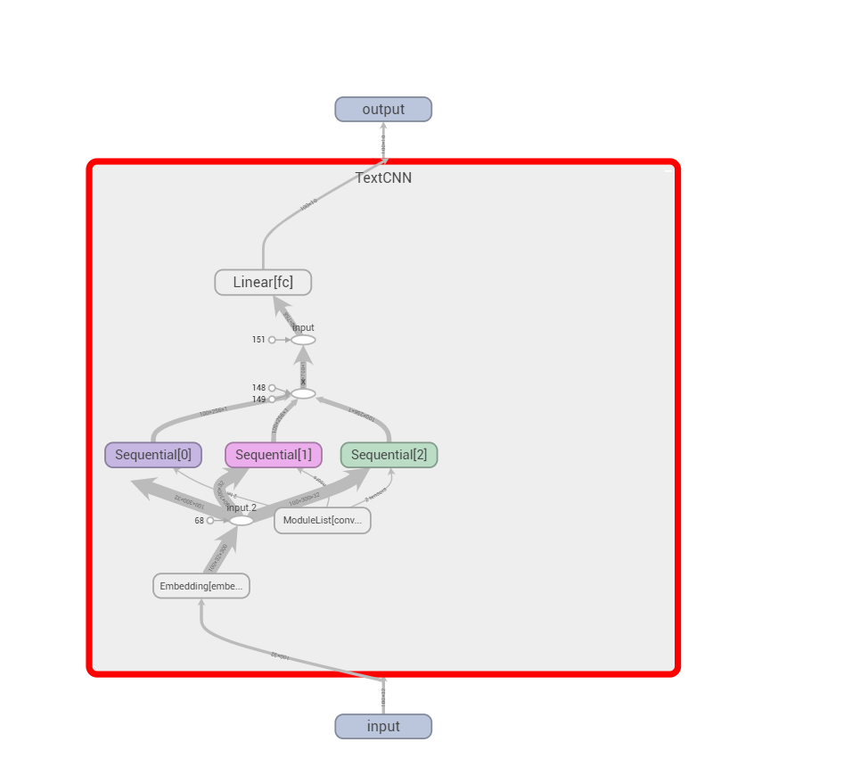

# Py-dnn
Deep Neural Networks Models powered by Pytorch

**version v0.0.3**

## Plans

- [x] ImageClassifier (CNN model)
  
  > Transfer learning (using well-known models like **ResNet**)

- [x] TextClassifier (CNN and RNN model)
   
  > Using word embeddings downloaded from Tencent or Sogou or Random
  
- [ ] ~~TextWriter~~ 

   > ~~maybe writing poems?~~ (Other repository)


## Modules

```shell
.
├── LICENSE
├── README.md
├── common.py
├── criterion
│   └── criterion.py
├── data_loader
│   ├── base_loader.py
│   ├── image_loader.py
│   └── text_loader.py
├── evaluate
│   └── image_classify_eval.py
├── model
│   ├── base_model.py
│   ├── image_classify_model.py
│   ├── save.py
│   └── text_classify_model.py
├── optimizer
│   └── optimizer.py
├── options
│   ├── base_opt.py
│   ├── image_classify_opt.py
│   └── text_classify_opt.py
├── plot
│   ├── base_plot.py
│   ├── image_classify_plot.py
│   └── text_classify_plot.py
├── resources
│   ├── data
│   ├── images
│   ├── log
│   ├── results
│   └── saved_model
├── run_func.py
├── run_image_classify.py
└── run_text_classify.py

13 directories, 23 files
```

## Usages 1

**like this**
```shell
$ usage: run_image_classify.py [--data DATA] [--out OUT] [--log LOG]
                             [--model_save MODEL_SAVE]
                             [--model {VGG,ResNet,DenseNet,ResNext}] [--again]
                             [--test] [--batch_size BATCH_SIZE]
                             [--epoch_num EPOCH_NUM] [--optimizer {Adam}]
                             [--learning_rate LEARNING_RATE] [--beta1 BETA1]
                             [--beta2 BETA2]
                             [--lr_scheduler {StepLR,ExponentialLR,CosineAnnealingLR}]
                             [--gamma GAMMA] [--loss {NLLLoss}]
                             [--thread_num THREAD_NUM] [--gpu_ids GPU_IDS]
                             [--plot] [--seed SEED] [--help]
```

| Resource Arguments | Dest       | Help                                                                                                                                                                           |
|--------------------|------------|--------------------------------------------------------------------------------------------------------------------------------------------------------------------------------|
| --data             | DATA       | for train, the path should have sub-folders train and valid;for test, should have sub-folders test. [reference docs](https://pytorch.org/vision/stable/datasets.html#imagefolder) |
| --log              | LOG        | path to the log folder to record information.                                                                                                                                  |
| --model_save       | MODEL_SAVE | models are saved here.
| etc..      | etc.. | etc..

**for example**

```shell
$ python run_image_classify.py --plot \
                               --model ResNet \
                               --data resources/data/flowers \
                               --model_save resources/saved_model/my_ResNet.pth \
                               --lr_scheduler StepLR \
                               --again
```

### Logs 

**for example**

```shell
$ tensorboard.exe --logdir .\log\
TensorFlow installation not found - running with reduced feature set.
Serving TensorBoard on localhost; to expose to the network, use a proxy or pass --bind_all
TensorBoard 2.4.1 at http://localhost:6006/ (Press CTRL+C to quit)
```
**like this**


## Usage 2

**like this**
```shell
$ usage: run_text_classify.py [--data DATA] [--out OUT] [--vocab VOCAB]
                            [--log LOG] [--model_save MODEL_SAVE]
                            [--model {TextRNN,TextCNN}]
                            [--embedding {Tencent,Sogou,Random}]
                            [--seq_len SEQ_LEN] [--word WORD] [--test]
                            [--batch_size BATCH_SIZE] [--epoch_num EPOCH_NUM]
                            [--optimizer {Adam}]
                            [--learning_rate LEARNING_RATE] [--beta1 BETA1]
                            [--beta2 BETA2]
                            [--lr_scheduler {StepLR,ExponentialLR,CosineAnnealingLR}]
                            [--gamma GAMMA]
                            [--loss {NLLLoss,CrossEntropyLoss}]
                            [--thread_num THREAD_NUM] [--gpu_ids GPU_IDS]
                            [--plot] [--plot_freq PLOT_FREQ] [--seed SEED]
                            [--help]
```

**for example**
```shell
python3 run_text_classify.py --plot 
                             --model TextRNN 
                             --data resources/data/news 
                             --model_save resources/saved_model/my_TextRNN.pth 
                             --lr_scheduler StepLR 
                             --vocab resources/data/news/vocab.pkl 
                             --batch_size 100 
                             --loss CrossEntropyLoss 
                             --embedding Random
```
### Logs 

**for example**

```shell
$ tensorboard.exe --logdir .\log\
TensorFlow installation not found - running with reduced feature set.
Serving TensorBoard on localhost; to expose to the network, use a proxy or pass --bind_all
TensorBoard 2.4.1 at http://localhost:6006/ (Press CTRL+C to quit)
```
**like this**


| TextCNN | TextRNN                                                                                                                                                                     |
|--------------------|------------
||

## PS

想了想还是不浪费计算机资源调整参数了，这个主要还是学习为主的demo小项目。下一步准备试试范闲写诗了。

